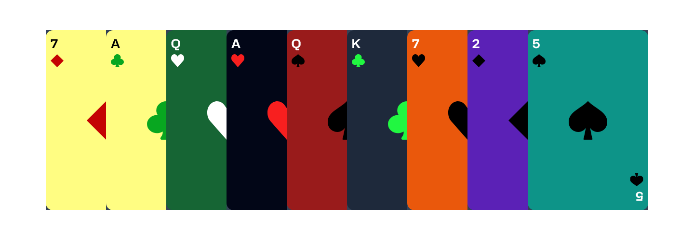

# The ultimate memory test!

## How To Play?

Get presented with a new memorization challenge each round. With an increasing number of unique playing cards each round, your memorization skills will be put to the test. You can only click on a unique playing card once, clicking the same card twice will result in a game over. Each card clicked will bring your score up!

Clicking every unique card once in the set will allow you to advance to a new level. With each new level the cards are re-shuffled and,
for an extra challenge, a brand new unique card is added to the set. How long can you keep it up?

Try to beat your personal best score or compete with your friends and family!

## Extremely Customizable1

Make the game your own! Customize everything from the way the background looks to the way your cards look. You can choose between many different options to customize the look and feel of the game. Change your background style and card background to get the perfect look for the game.

## Features

CardBoard is a fully fleshed out game that has many different features, including:

- Completely customizable cards
- Customizable background styles
- 4 different suit colors
- Ability to enable or disable card borders (if you want your cards to stand out more)
- Different border colors
- Ultra responsive design that can work on any screen size
- Fully functional navigation
- Interactive sound effects for:
    - Game Start
    - Card Click
    - New Round Start
    - Game Over
    - Restart 
- Custom suit cursor on Title Screen
- Choice persistence - your choices will be remembered between game sessions
- Personal Best score persistence between sessions

### Possible Future Updates:

This game will be continually updated, here are some future possible updates:

- Different suit styles,
- Different card layouts
- Different colors for each suit (hearts, diamonds, spades, clubs)
- Leaderboard with your best scores
- Even more customization!
- New game modes!
