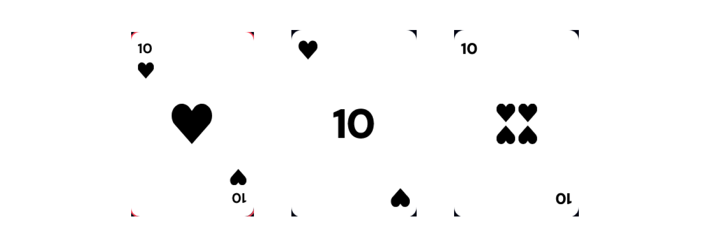

# The Ultimate Memory Test!

## How To Play?

Get presented with a new memorization challenge each round. With an increasing number of unique playing cards each round, your memorization skills will be put to the test. You can only click on a unique playing card once, clicking the same card twice will result in a game over. Each card clicked will bring your score up!

Clicking every unique card once in the set will allow you to advance to a new level. With each new level the cards are re-shuffled and,
for an extra challenge, a brand new unique card is added to the set. How long can you keep it up?

Try to beat your personal best score or compete with your friends and family!

## Extremely Customizable

Make the game your own! Customize everything from the way the background looks to the way your cards look. You can choose between many different options to customize the look and feel of the game. Change your background style and card background to get the perfect look for the game.

#### Card Colors

#### Card Styles

## Features

CardBoard is a fully fleshed out game that has many different features, including:

- Completely customizable cards
- Customizable background styles
- 3 different card types
- Many different suit colors
- Ability to enable or disable card borders (if you want your cards to stand out more)
- Ability to make card borders be the same color as their suits
- Different border colors
- Cool border glow effects!
- Ultra responsive design that can work on any screen size
- Fully functional navigation
- Custom cursor
- Interactive sound effects for:
    - Game Start
    - Card Click
    - New Round Start
    - Game Over
    - Restart 
- Choice persistence - your choices will be remembered between game sessions
- Personal Best score persistence between sessions

## Play The Game

Play the game and test your memory right now 👉 [Play CardBoard](https://play-cardboard.netlify.app)

### Possible Future Updates:

This game will be continually updated, here are some future possible updates:

- Different suit styles
- ~~Different card styles~~ - Added
- ~~Different colors for each suit (hearts, diamonds, spades, clubs)~~ - Added
- Leaderboard with your best scores
- Even more customization!
- New game modes!

### Built With:

- React.js
- Zustand - for state management
- React Router - for navigating between pages
- TailwindCSS - for styling
- react-slick - for option slides
- Phosphor Icons - for the amazing icons

### Author

Built with ❤️ by [atanasovCode](https://github.com/AtanasovCode/)
